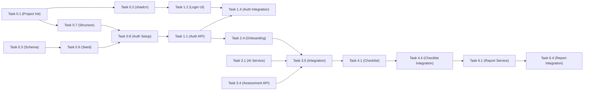

# AI-Assured Compliance Dashboard — Project Task Board


| Category               | Details                                                                                                                |
| ---------------------- | ---------------------------------------------------------------------------------------------------------------------- |
| **Team**               | 2 Frontend Developers (FE1, FE2)<br>2 Backend Developers (BE1, BE2)<br>2 Database/Infrastructure Developers (DB1, DB2) |
| **Tech Stack**         | Next.js 14<br>TypeScript<br>Prisma<br>PostgreSQL<br>shadcn/ui<br>Tailwind CSS<br>Zustand<br>Vercel AI SDK              |
| **Estimated Duration** | ~10 Sprints                                                                                                            |
| **Sprint Length**      | 1 Week per Sprint                                                                                                      |
| **Total Timeline**     | ~10 Weeks                                                                                                              |


## Legend

| Symbol | Meaning |
|--------|---------|
| `[ ]` | Not Started |
| `[/]` | In Progress |
| `[x]` | Completed |
| 🔴 | Critical Path / Blocker |
| 🟡 | Medium Priority |
| 🟢 | Can be parallelized |
| `→` | Depends on |

---

## Sprint 0 — Project Bootstrap & Environment Setup *(Week 1)*

> **Goal**: All devs can run the project locally. CI/CD pipeline working. DB schema ready.
> **All roles work in parallel.**

### Task 0.1: Initialize Next.js Project 🔴
**Assignee**: FE1
**Branch**: `chore/fe1/project-init`
**Story Points**: 3

- [ ] Create Next.js 14 app with App Router (`npx create-next-app@latest ./ --typescript --tailwind --eslint --app --src-dir=no`)
- [ ] Configure `tsconfig.json` with strict mode and path aliases (`@/`)
- [ ] Setup `.env.example` with all required variables (see README)
- [ ] Add `.prettierrc`, `.eslintrc.json` with team coding standards
- [ ] Add Husky + lint-staged for pre-commit hooks
- [ ] Configure `next.config.js` (security headers, image domains)
- [ ] Create initial `package.json` scripts (`dev`, `build`, `lint`, `lint:fix`, `type-check`, `format`)
- [ ] Push to `dev` branch, create PR

**Acceptance**: `pnpm dev` starts at `localhost:3000` with no errors.

---

### Task 0.2: Setup shadcn/ui & Design System 🔴
**Assignee**: FE2
**Branch**: `chore/fe2/design-system-setup`
**Story Points**: 5
**Depends on**: Task 0.1

- [ ] Install and initialize shadcn/ui (`npx shadcn-ui@latest init`)
- [ ] Configure `tailwind.config.ts` with brand colors from design guidelines:
  ```
  Primary: #6d18ff | Primary Dark: #5412cc | Primary Light: #8f4dff | Primary Pale: #e9ddff
  Success: #10b981 | Warning: #f59e0b | Error: #ef4444 | Info: #8b5cf6
  ```
- [ ] Update `globals.css` with CSS variables for light/dark themes
- [ ] Install core shadcn/ui components: Button, Card, Input, Form, Select, Dialog, Table, Tabs, Badge, Dropdown Menu, Toast, Progress, Checkbox, Separator, Skeleton, Sheet, Avatar, Tooltip
- [ ] Setup Google Font "Inter" in `layout.tsx`
- [ ] Create `lib/utils.ts` with `cn()` helper
- [ ] Create design tokens documentation in `docs/design-tokens.md`

**Acceptance**: All components render with brand purple theme.

---

### Task 0.3: Database Schema & Prisma Setup 🔴
**Assignee**: DB1
**Branch**: `feat/db1/prisma-schema-setup`
**Story Points**: 8

- [ ] Install Prisma (`pnpm add -D prisma && pnpm add @prisma/client`)
- [ ] Create `prisma/schema.prisma` with complete schema:
  - `User` model (id, email, name, password, role, timestamps)
  - `Organization` model (business profile fields, dataHandled[], regions[])
  - `Framework` model (code, name, description, region, category, version, status)
  - `Control` model (code, title, description, category, severity, weight)
  - `Assessment` model (userId, organizationId, status, score)
  - `AssessmentItem` model (assessmentId, controlId, status, comments)
  - `Evidence` model (file metadata, S3 URL)
  - `Report` model (type, format, fileUrl)
  - `AIInteraction` model (type, input, output, model, tokensUsed)
- [ ] Define all enums: `Role`, `FrameworkStatus`, `Severity`, `AssessmentStatus`, `ItemStatus`, `ReportType`, `ReportFormat`, `AIType`
- [ ] Add proper indexes (`@@index`) and unique constraints (`@@unique`)
- [ ] Generate initial migration (`pnpm prisma migrate dev --name init`)
- [ ] Create `lib/prisma.ts` singleton client
- [ ] Verify with `pnpm prisma studio`

**Acceptance**: `prisma migrate dev` runs successfully. All tables created in PostgreSQL.

---

### Task 0.4: Docker Compose & Local Dev Environment (Optional)
```Note
Note: You can use Neon instance for the development purpose
```
**Assignee**: DB2
**Branch**: `chore/db2/docker-setup`
**Story Points**: 3

- [ ] Create `docker-compose.yml` with:
  - PostgreSQL 16 (port 5432)
  - Redis 7 (port 6379)
  - MinIO (ports 9000, 9001) for local S3
- [ ] Create `docker-compose.override.yml` for local dev overrides
- [ ] Add health checks for all services
- [ ] Write setup script (`scripts/setup-dev.sh`) for first-time setup
- [ ] Document in `docs/local-setup.md`

**Acceptance**: `docker-compose up -d` starts all services. Health checks pass.

---

### Task 0.5: CI/CD Pipeline Setup (Optional | Skip)
**Assignee**: DB2
**Branch**: `chore/db2/ci-cd-pipeline`
**Story Points**: 5
**Depends on**: Task 0.1

- [ ] Create `.github/workflows/ci.yml`:
  - Trigger on PR to `dev`, `stage`, `main`
  - Steps: Install → Lint → Type Check → Unit Tests → Build
- [ ] Create `.github/workflows/deploy.yml`:
  - Auto-deploy `dev` to Vercel preview
  - Auto-deploy `main` to Vercel production
- [ ] Configure branch protection rules:
  - `main`: 2 approvals required, all CI checks pass
  - `stage`: 1 approval, all CI checks pass
  - `dev`: 1 approval, all CI checks pass
- [ ] Setup Vercel project and link repository

**Acceptance**: PRs trigger CI. Merges to `dev` auto-deploy.

---

### Task 0.6: Seed Data Script
**Assignee**: DB1
**Branch**: `feat/db1/seed-data`
**Story Points**: 5
**Depends on**: Task 0.3

- [ ] Create `prisma/seed.ts` with:
  - Admin user (admin@cipherion.com / Admin@123)
  - Test user (user@test.com / User@1234)
  - 3 compliance frameworks with controls: (Get the required details from Arfa)
    - GDPR (15+ controls across categories)
    - HIPAA (15+ controls across categories)
    - PCI-DSS (10+ controls)
  - Sample organization profile
  - Sample assessment with mixed statuses
- [ ] Add `prisma.seed` config in `package.json`
- [ ] Test with `pnpm prisma db seed`

**Acceptance**: `prisma db seed` populates all tables with realistic test data.

---

### Task 0.7: Project Folder Structure & Shared Types
**Assignee**: BE1
**Branch**: `chore/be1/project-structure`
**Story Points**: 3
**Depends on**: Task 0.1

- [ ] Create folder structure as per architecture doc:
  ```
  app/(auth)/, app/(user)/, app/(admin)/, app/api/
  components/ui/, components/layout/, components/auth/, components/user/, components/admin/, components/ai/, components/reports/
  lib/, services/, stores/, types/, tests/
  ```
- [ ] Create shared TypeScript types in `types/`:
  - `types/user.ts`, `types/framework.ts`, `types/assessment.ts`, `types/api.ts`
- [ ] Setup Zod validation schemas in `lib/validations/`:
  - `auth.ts`, `organization.ts`, `framework.ts`, `assessment.ts`
- [ ] Create API response helpers in `lib/api-helpers.ts`

**Acceptance**: All folders exist. TypeScript types compile without errors.

---

### Task 0.8: Authentication Library Setup 🔴
**Assignee**: BE2
**Branch**: `feat/be2/auth-setup`
**Story Points**: 5
**Depends on**: Task 0.3, Task 0.7

- [ ] Install **BetterAuth** (or NextAuth.js) + bcrypt + jose
- [ ] Configure `lib/auth.ts` with:
  - Credentials provider (email/password)
  - JWT strategy (7-day expiration)
  - Session callback (include role, userId)
  - bcrypt password hashing (cost factor 12)
- [ ] Create auth middleware for API route protection
- [ ] Create `lib/auth-helpers.ts`:
  - `getSession()` — get current session
  - `requireAuth()` — throw 401 if not authenticated
  - `requireAdmin()` — throw 403 if not admin
  - `hashPassword()` / `verifyPassword()`
- [ ] Add rate limiting utility (`lib/rate-limit.ts`) — 5 failed attempts = 15 min lockout

**Acceptance**: Auth system initializes. Middleware protects routes.

---

## Sprint 0 — Authentication & Layout *(Week 1)*

> **Goal**: Users can register, login, see a layout shell. Auth flow complete end-to-end.
> **Parallel streams**: FE does UI, BE does APIs, DB monitors.

### Task 1.1: Auth API Routes 🔴
**Assignee**: BE1
**Branch**: `feat/be1/auth-api-routes`
**Story Points**: 8
**Depends on**: Task 0.8

- [ ] `POST /api/auth/register` — Create user with hashed password, validate email uniqueness, return JWT
- [ ] `POST /api/auth/login` — Validate credentials, return JWT, update lastLoginAt
- [ ] `POST /api/auth/logout` — Invalidate session
- [ ] `GET /api/auth/me` — Return current user profile
- [ ] `POST /api/auth/forgot-password` — Send reset email (stub for now)
- [ ] `POST /api/auth/reset-password` — Reset with token (stub for now)
- [ ] Add Zod validation on all inputs
- [ ] Add rate limiting on login endpoint
- [ ] Write unit tests for all routes

**Acceptance**: All auth endpoints work via Postman. Tests pass.

---

### Task 1.2: Login Page UI 🟢
**Assignee**: FE1
**Branch**: `feat/fe1/login-page`
**Story Points**: 8
**Depends on**: Task 0.2

- [ ] Create `app/(auth)/layout.tsx` — 60/40 split layout
- [ ] Build left panel:
  - Purple gradient background (#6d18ff → #4c1d95)
  - Cipherion logo, heading, subheading, feature bullets
  - Trust badges (SOC 2, GDPR Ready)
  - Subtle animated background (CSS particles or geometric patterns)
- [ ] Build `app/(auth)/login/page.tsx`:
  - Login form with React Hook Form + Zod
  - Email input (with envelope icon)
  - Password input (with lock icon, show/hide toggle)
  - "Remember me" checkbox + "Forgot password?" link
  - "Sign in" button (purple, full-width, loading state)
  - "OR" divider + "Don't have an account? Sign up" link
  - Footer copyright
- [ ] Responsive: mobile stacks vertically
- [ ] Micro-interactions: focus glow, hover states, loading spinner
- [ ] Reference: `assets/1. Authentication Page/`

**Acceptance**: Pixel-perfect match to design. Form validates. Responsive.

---

### Task 1.3: Signup Page UI 🟢
**Assignee**: FE2
**Branch**: `feat/fe2/signup-page`
**Story Points**: 5
**Depends on**: Task 0.2

- [ ] Create `app/(auth)/register/page.tsx`:
  - Full name, company name, work email, password, confirm password
  - Password strength indicator (weak/medium/strong bar)
  - Terms & privacy checkbox
  - "Create account" button
  - "Already have an account? Sign in" link
- [ ] Reuse auth layout from Task 1.2
- [ ] Form validation with React Hook Form + Zod
- [ ] Smooth transition animation between login/signup

**Acceptance**: Signup form validates all fields. Password strength works.

---

### Task 1.4: Auth Integration (Frontend ↔ Backend)
**Assignee**: FE1
**Branch**: `feat/fe1/auth-integration`
**Story Points**: 5
**Depends on**: Task 1.1, Task 1.2, Task 1.3

- [ ] Create `lib/api-client.ts` with typed fetch wrapper (handles tokens, errors)
- [ ] Create `stores/auth-store.ts` (Zustand):
  - `user`, `isAuthenticated`, `isLoading`
  - `login()`, `register()`, `logout()`, `checkSession()`
- [ ] Wire login form → API → redirect to dashboard
- [ ] Wire signup form → API → redirect to login (with success toast)
- [ ] Add auth guard: redirect unauthenticated users to `/login`
- [ ] Add role-based redirect: admin → admin dashboard, user → user dashboard
- [ ] Handle errors: show toast for invalid credentials, server errors
- [ ] Test full flow: register → login → dashboard → logout

**Acceptance**: End-to-end auth flow works. Protected routes enforce login.

---

### Task 1.5: App Layout Shell (Sidebar + Header + Footer) 🟢
**Assignee**: FE2
**Branch**: `feat/fe2/app-layout`
**Story Points**: 5
**Depends on**: Task 0.2

- [ ] Create `components/layout/header.tsx`:
  - Logo (purple), navigation links (Dashboard, Assessments, Reports)
  - Help icon, notification bell (with badge), user avatar dropdown
- [ ] Create `components/layout/sidebar.tsx`:
  - 240px width, Gray-50 background
  - Nav items: Dashboard, Assessments, Reports, Settings
  - Active state (purple highlight)
  - Collapsible on mobile (Sheet component)
  - "Need help?" support card at bottom
- [ ] Create `components/layout/footer.tsx`
- [ ] Create `app/(user)/layout.tsx` using header + sidebar
- [ ] Create `app/(admin)/layout.tsx` with admin sidebar items (Frameworks, Users)
- [ ] Responsive breakpoints (768px, 1024px, 1280px)

**Acceptance**: Layout renders. Sidebar collapses on mobile. Active states work.

---

### Task 1.6: Health Check & API Middleware
**Assignee**: BE2
**Branch**: `feat/be2/api-middleware`
**Story Points**: 3
**Depends on**: Task 0.7

- [ ] Create `GET /api/health` — returns `{ status: "ok", timestamp, version }`
- [ ] Create global API error handler middleware
- [ ] Create request logging middleware
- [ ] Create CORS configuration
- [ ] Add security headers in `next.config.js`
- [ ] Write integration tests for health endpoint

**Acceptance**: `/api/health` returns 200. Error handler catches unhandled errors.

---

### Task 1.7: Documentation — API Specs (Phase 1)
**Assignee**: DB2 *(role: documentation)*
**Branch**: `docs/db2/api-specs-auth`
**Story Points**: 3

- [ ] Create `docs/API.md` with Auth endpoints:
  - Request/response formats
  - Error codes
  - Rate limiting details
  - Authentication flow diagram
- [ ] Document environment setup steps
- [ ] Create Postman collection for auth endpoints

**Acceptance**: API docs reviewed by BE devs. Postman collection importable.

---

## Sprint 1 — Dashboard & Organization Onboarding *(Week 2)*

> **Goal**: Dashboard (empty + active states) + Organization onboarding form.
> **Parallel**: FE builds UI, BE builds APIs, DB focuses on query optimization.

### Task 2.1: Organization API Routes
**Assignee**: BE1
**Branch**: `feat/be1/organization-api`
**Story Points**: 5
**Depends on**: Task 1.1

- [ ] `POST /api/organizations` — Create organization profile with validation
- [ ] `GET /api/organizations/:id` — Get organization by ID (with auth check)
- [ ] `PATCH /api/organizations/:id` — Update organization profile
- [ ] Auto-save support (PATCH with partial data)
- [ ] Zod validation for all fields (char limits, required fields)
- [ ] Unit tests

**Acceptance**: CRUD operations work. Validation enforces all PRD constraints.

---

### Task 2.2: Dashboard — Empty State UI
**Assignee**: FE1
**Branch**: `feat/fe1/dashboard-empty`
**Story Points**: 5
**Depends on**: Task 1.5

- [ ] Create `app/(user)/dashboard/page.tsx`
- [ ] Hero section: welcome message with gradient card, illustration
- [ ] Empty state card: "No assessments yet" with large CTA button
- [ ] "How it works" 3-step cards (Describe → AI Analyzes → Complete)
- [ ] Help resources section (4 cards: Docs, Tutorial, Support, Demo)
- [ ] Reference: `assets/2. Dashboard Empty State/`

**Acceptance**: Matches design. CTA navigates to onboarding.

---

### Task 2.3: Dashboard — Active State UI
**Assignee**: FE2
**Branch**: `feat/fe2/dashboard-active`
**Story Points**: 8
**Depends on**: Task 1.5

- [ ] Key metrics row (4 cards: Total Assessments, Avg Score, Critical Gaps, Reports)
- [ ] Active assessments list (cards with circular progress, framework badges, mini bars)
- [ ] Recent activity timeline (purple vertical line, icons, timestamps)
- [ ] Right column: Quick Actions card (purple gradient), Compliance Health donut chart, Top Priority Risks, Upcoming Tasks
- [ ] Create reusable chart components (circular progress, donut chart, stacked bar)
- [ ] Reference: `assets/3. Dashboard_-_active_state/`

**Acceptance**: Dashboard renders with mock data. All charts display correctly.

---

### Task 2.4: Business Profile Onboarding Form UI
**Assignee**: FE1
**Branch**: `feat/fe1/onboarding-form`
**Story Points**: 8
**Depends on**: Task 0.2

- [ ] Create `app/(user)/onboarding/page.tsx`
- [ ] Progress stepper (Step 1: Business Profile → Step 2: Framework Selection → Step 3: Review)
- [ ] Multi-section form with React Hook Form:
  - Section 1: Product info (name, description, services, customers, problem)
  - Section 2: Data handling (checkbox grid — PII, PHI, Financial, Payment, etc.)
  - Section 3: Regions (checkbox grid with flag icons)
- [ ] Character counters, helper text, tooltips, validation messages
- [ ] Auto-save indicator ("All changes saved" / "Saving...")
- [ ] Bottom action bar: Save Draft | Back | Next →
- [ ] Reference: `assets/4. Assessment Business Profile Step/`

**Acceptance**: Form validates. Auto-save works. Character limits enforced.

---

### Task 2.5: Dashboard Data Integration
**Assignee**: BE2
**Branch**: `feat/be2/dashboard-api`
**Story Points**: 5
**Depends on**: Task 2.1

- [ ] `GET /api/dashboard` — Aggregated dashboard data:
  - Total assessments count
  - Average compliance score
  - Critical gaps count
  - Reports generated count
  - Recent activity (last 10 actions)
  - Assessment summaries with per-framework scores
- [ ] Efficient PostgreSQL queries with proper JOINs
- [ ] Add caching strategy for dashboard data

**Acceptance**: Dashboard API returns correct aggregations.

---

### Task 2.6: Database Query Optimization & Indexes
**Assignee**: DB1
**Branch**: `perf/db1/query-optimization`
**Story Points**: 3
**Depends on**: Task 0.3, Task 0.6

- [ ] Review and optimize Prisma queries for N+1 problems
- [ ] Add composite indexes for common query patterns
- [ ] Run `EXPLAIN ANALYZE` on complex queries
- [ ] Ensure assessment score calculation < 100ms
- [ ] Document query patterns in `docs/database-queries.md`

**Acceptance**: All queries meet NFR-PERF-005 (simple < 50ms, complex < 200ms).

---

## Sprint 3 — AI Framework Mapping & Framework Selection *(Week 3)*

> **Goal**: AI suggests compliance frameworks. User selects and creates assessment.

### Task 3.1: AI Service — Compliance Mapping
**Assignee**: BE1
**Branch**: `feat/be1/ai-mapping-service`
**Story Points**: 8

- [ ] Install Vercel AI SDK (`pnpm add ai @ai-sdk/openai`)
- [ ] Create `services/ai-service.ts` with `mapCompliance()` method
- [ ] Craft prompt template for framework mapping (with few-shot examples)
- [ ] Parse AI JSON response with error handling and retry logic
- [ ] `POST /api/ai/map-compliance` — Accepts org profile, returns framework suggestions
- [ ] Implement response caching (24-hour TTL via Redis or in-memory)
- [ ] Log AI interaction to `AIInteraction` table
- [ ] Rate limit: 10 AI requests/hour per user
- [ ] Timeout handling (10s limit with fallback)
- [ ] Unit tests with mocked AI responses

**Acceptance**: AI returns ranked framework suggestions with confidence scores.

---

### Task 3.2: Framework Selection Page UI
**Assignee**: FE2
**Branch**: `feat/fe2/framework-selection`
**Story Points**: 8
**Depends on**: Task 2.4

- [ ] Create `app/(user)/onboarding/suggested-frameworks/page.tsx`
- [ ] Loading state: pulsing AI animation, rotating text messages, progress bar
- [ ] Framework cards with:
  - Checkbox (pre-selected if confidence > 85%)
  - Framework name, full name, region/category badges
  - Confidence score (circular indicator, color-coded)
  - "Why this applies" explanation text
  - Expandable "Key requirements" section
  - Relevance tags
  - Control count + estimated time
- [ ] Selection summary sidebar (sticky): selected list, total controls, CTA
- [ ] Manual framework search dropdown
- [ ] Stagger-fade animation on card load
- [ ] Reference: `assets/5. Assessment Framework Selection Step/` and `assets/6. AI Compliance Recommendation Loading screen/` and `assets/7. Compliance Recommendation/`

**Acceptance**: Cards animate in. Selection toggles work. Summary updates in real-time.

---

### Task 3.3: Framework CRUD API (Admin)
**Assignee**: BE2
**Branch**: `feat/be2/framework-api`
**Story Points**: 8

- [ ] `GET /api/frameworks` — List frameworks (with pagination, filters)
- [ ] `POST /api/frameworks` — Create framework (admin only)
- [ ] `GET /api/frameworks/:id` — Get framework with controls
- [ ] `PATCH /api/frameworks/:id` — Update framework (admin only)
- [ ] `DELETE /api/frameworks/:id` — Delete framework (admin only, if unused)
- [ ] `POST /api/frameworks/:id/controls` — Add control to framework
- [ ] `PATCH /api/frameworks/:id/controls/:controlId` — Update control
- [ ] `DELETE /api/frameworks/:id/controls/:controlId` — Delete control
- [ ] `POST /api/frameworks/:id/controls/import` — Bulk CSV import with PapaParse
- [ ] `POST /api/frameworks/:id/publish` — Publish framework (validates completeness)
- [ ] All endpoints require admin role
- [ ] Zod validation, proper error messages
- [ ] Unit + integration tests

**Acceptance**: Full CRUD works. CSV import processes correctly. Publish validates.

---

### Task 3.4: Assessment Creation API
**Assignee**: BE1
**Branch**: `feat/be1/assessment-creation-api`
**Story Points**: 5
**Depends on**: Task 3.3

- [ ] `POST /api/assessments` — Create assessment:
  - Accept `organizationId` + `frameworkIds[]`
  - Fetch all controls for selected frameworks
  - Create Assessment + AssessmentItems in transaction
  - Return assessment with item count
- [ ] `GET /api/assessments` — List user's assessments (with status, scores)
- [ ] `GET /api/assessments/:id` — Full assessment detail with items, controls, framework info
- [ ] Write integration tests

**Acceptance**: Assessment creation is atomic. Items created for all framework controls.

---

### Task 3.5: Onboarding Integration (Frontend ↔ Backend)
**Assignee**: FE1
**Branch**: `feat/fe1/onboarding-integration`
**Story Points**: 5
**Depends on**: Task 2.4, Task 3.1, Task 3.2, Task 3.4

- [ ] Wire onboarding form → `POST /api/organizations`
- [ ] Wire "Next" → `POST /api/ai/map-compliance` → show loading → show results
- [ ] Wire framework selection → `POST /api/assessments`
- [ ] Create `stores/assessment-store.ts` (Zustand) for onboarding state
- [ ] Handle errors, retries, timeout states
- [ ] Redirect to assessment dashboard after creation
- [ ] Test full flow end-to-end

**Acceptance**: User can go from onboarding → AI suggestions → create assessment.

---

## Sprint 4 — Assessment Checklist & Control Workspace *(Week 4)*

> **Goal**: Users can view and update compliance checklist items. Score updates in real-time.

### Task 4.1: Assessment Checklist Page UI
**Assignee**: FE1
**Branch**: `feat/fe1/assessment-checklist`
**Story Points**: 13
**Depends on**: Task 1.5

- [ ] Create `app/(user)/assessments/[id]/checklist/page.tsx`
- [ ] Sticky metrics bar: overall progress (circle), framework breakdown (mini bars), status distribution (stacked bar), critical gaps count
- [ ] Filter bar: search input, framework multi-select, status multi-select, severity multi-select
- [ ] Applied filters as pills with "Clear all"
- [ ] Sort dropdown (severity, status, control ID, last updated)
- [ ] Checklist items grouped by framework (collapsible sections):
  - Control ID, title, severity badge, status dropdown, evidence count, last updated
  - Expandable description
- [ ] Pagination (50 items/page)
- [ ] Status dropdown: inline change with color-coded options
- [ ] Loading skeletons, empty states
- [ ] Reference: `assets/9. compliance_checklist/`

**Acceptance**: Checklist renders with all filters/sort working. Groups collapse.

---

### Task 4.2: Control Assessment Workspace (Detail Panel)
**Assignee**: FE2
**Branch**: `feat/fe2/control-workspace`
**Story Points**: 8

- [ ] Create control detail modal/slide-over panel:
  - Control ID, title, description, severity badge, weight
  - Status dropdown (Not Started, Compliant, Partially Compliant, Not Compliant, Not Applicable)
  - Comments textarea (1000 char limit)
  - Evidence section (list uploaded files, upload button)
  - "Get Remediation Plan" button (for non-compliant items)
  - Save/Cancel buttons
- [ ] Optimistic UI updates (status changes reflect immediately)
- [ ] Success/error toasts
- [ ] Reference: `assets/8. Control_assessment_workspace/`

**Acceptance**: Status changes save immediately. Score recalculates. Evidence displays.

---

### Task 4.3: Assessment Item Update API & Scoring
**Assignee**: BE1
**Branch**: `feat/be1/assessment-items-api`
**Story Points**: 8

- [ ] `PATCH /api/assessments/:id/items/:itemId` — Update status + comments
- [ ] `GET /api/assessments/:id/score` — Calculate and return score
- [ ] Implement weighted scoring algorithm (from PRD):
  - Compliant=1.0, Partial=0.5, Non-Compliant=0.0, N/A=excluded
  - Score = (Σ item_score × weight) / (Σ weight) × 100
- [ ] Calculate per-framework scores
- [ ] Auto-recalculate on every status change
- [ ] Return updated score in PATCH response
- [ ] Status filter/sort query support
- [ ] Pagination support (50 items/page)
- [ ] Unit tests for scoring algorithm edge cases

**Acceptance**: Scoring matches PRD formula. All filters/sort work.

---

### Task 4.4: Assessment Checklist Integration
**Assignee**: FE1
**Branch**: `feat/fe1/checklist-integration`
**Story Points**: 5
**Depends on**: Task 4.1, Task 4.2, Task 4.3

- [ ] Wire checklist to `GET /api/assessments/:id` with filter/sort params
- [ ] Wire status changes to `PATCH /api/assessments/:id/items/:itemId`
- [ ] Wire score display to API response
- [ ] Update Zustand assessment store
- [ ] TanStack Query for data fetching + cache invalidation
- [ ] Real-time score update in metrics bar
- [ ] Test with seed data

**Acceptance**: Full checklist flow works end-to-end. Score updates in real-time.

---

### Task 4.5: Redis Caching Layer
**Assignee**: DB2
**Branch**: `feat/db2/redis-caching`
**Story Points**: 5

- [ ] Install ioredis (`pnpm add ioredis`)
- [ ] Create `lib/redis.ts` singleton client
- [ ] Cache dashboard aggregation queries (5-min TTL)
- [ ] Cache AI responses (24-hour TTL)
- [ ] Cache framework list for non-admin users (1-hour TTL)
- [ ] Add cache invalidation on relevant data mutations
- [ ] Graceful fallback when Redis unavailable

**Acceptance**: Cache hit/miss logged. Performance improvement measurable.

---

## Sprint 5 — AI Remediation & Evidence Upload *(Week 5)*

> **Goal**: AI remediation plans. Evidence file upload/download.

### Task 5.1: AI Remediation Service & API
**Assignee**: BE1
**Branch**: `feat/be1/ai-remediation`
**Story Points**: 8

- [ ] Add `generateRemediation()` to `services/ai-service.ts`
- [ ] Craft prompt with control details + framework context
- [ ] Parse structured JSON response (steps, policies, technical controls)
- [ ] `POST /api/ai/remediation` — Accept control details, return plan
- [ ] Cache responses (control-level, 24-hour TTL)
- [ ] Log to AIInteraction table
- [ ] Allow regeneration (bypass cache)
- [ ] Unit tests with mocked responses

**Acceptance**: Remediation plan generates within 10s with actionable steps.

---

### Task 5.2: AI Remediation UI
**Assignee**: FE2
**Branch**: `feat/fe2/ai-remediation-ui`
**Story Points**: 8

- [ ] Create `components/ai/remediation-plan.tsx`:
  - Loading state with AI thinking animation
  - Prioritized steps list (HIGH/MEDIUM/LOW badges)
  - Each step: title, description, owner, estimated hours
  - Policy suggestions section
  - Technical controls section
  - "Regenerate", "Save Plan", "Export as PDF" buttons
- [ ] Integrate into control detail panel (Task 4.2)
- [ ] Displays only for non-compliant/partially compliant items
- [ ] Reference: `assets/11. AI Remediation/`

**Acceptance**: Plan renders beautifully. Loading animation smooth.

---

### Task 5.3: Evidence Upload API (File Storage)
**Assignee**: BE2
**Branch**: `feat/be2/evidence-upload-api`
**Story Points**: 8

- [ ] Install Multer + AWS S3 SDK (`pnpm add multer @aws-sdk/client-s3`)
- [ ] Create `services/storage-service.ts`:
  - Upload to S3/MinIO
  - Generate signed download URLs (7-day expiry)
  - Delete from S3
- [ ] `POST /api/evidence/upload` — Multipart upload with validation:
  - File types: PDF, DOCX, XLSX, TXT, PNG, JPG, CSV, ZIP
  - Max size: 10MB per file
  - Max 20 files per assessment item
- [ ] `GET /api/evidence/:id` — Generate fresh download URL
- [ ] `DELETE /api/evidence/:id` — Delete file + S3 object
- [ ] Virus scan integration (ClamAV) — stub if not available
- [ ] Store metadata in Evidence table
- [ ] Unit + integration tests

**Acceptance**: Files upload to S3. Download URLs work. Deletion removes from S3.

---

### Task 5.4: Evidence Upload UI Component
**Assignee**: FE2
**Branch**: `feat/fe2/evidence-upload-ui`
**Story Points**: 5
**Depends on**: Task 5.3

- [ ] Create `components/user/evidence-uploader.tsx`:
  - Drag & drop zone
  - File type/size validation (client-side)
  - Upload progress bar
  - Description input for each file
  - Uploaded files list with: icon, name, size, date, uploader, Download/Delete
- [ ] Integrate into control detail panel
- [ ] Loading states, error handling

**Acceptance**: Upload with drag-drop works. Progress shows. Files listed.

---

## Sprint 5 — Reporting & Analytics *(Week 6)*

> **Goal**: PDF report generation. Analytics dashboard. Compliance readiness report.

### Task 6.1: Report Generation Service & API
**Assignee**: BE1
**Branch**: `feat/be1/report-generation`
**Story Points**: 13

- [ ] Install PDFKit (`pnpm add pdfkit`)
- [ ] Create `services/report-service.ts`:
  - Generate comprehensive PDF with all sections (see PRD FR-RPT-001):
    - Cover page, Executive summary, Org profile, Framework scores
    - Risk summary, Control status breakdown (table), Evidence inventory
    - Remediation recommendations, Appendices
  - Professional formatting with Cipherion branding (purple headers, tables)
  - Charts/graphs as images (use `canvas` or pre-rendered SVGs)
- [ ] `POST /api/reports/:assessmentId/generate` — Generate + upload to S3
- [ ] `GET /api/reports/:assessmentId/download` — Signed download URL
- [ ] AI narrative generation for executive summary
- [ ] Save Report record to DB
- [ ] Generation target: < 5 seconds

**Acceptance**: PDF generates with all sections. Professional formatting. < 5s.

---

### Task 6.2: Compliance Analytics Dashboard UI
**Assignee**: FE1
**Branch**: `feat/fe1/analytics-dashboard`
**Story Points**: 8

- [ ] Create analytics/reporting page or enhance existing dashboard
- [ ] Compliance trend chart (line graph over time)
- [ ] Framework comparison chart (grouped bar chart)
- [ ] Risk heatmap visualization
- [ ] Status distribution pie/donut chart
- [ ] Control completion by category
- [ ] Use lightweight charting library (recharts or chart.js)
- [ ] Reference: `assets/10. compliance_analytics_dashboard/`

**Acceptance**: Charts render with accurate data. Interactive tooltips work.

---

### Task 6.3: Compliance Readiness Report UI
**Assignee**: FE2
**Branch**: `feat/fe2/compliance-report-ui`
**Story Points**: 5

- [ ] Create `app/(user)/assessments/[id]/report/page.tsx`
- [ ] Web view of compliance report (HTML version):
  - Executive summary card
  - Framework scores table
  - Risk summary visualization
  - Download PDF button
  - Share link button
  - Print stylesheet
- [ ] "Generate Report" button with loading state
- [ ] Report history (list of previously generated reports)
- [ ] Reference: `assets/12. Compliance Rediness Report/`

**Acceptance**: Web report renders. PDF downloads. Share link works.

---

### Task 6.4: Report Integration
**Assignee**: FE1
**Branch**: `feat/fe1/report-integration`
**Story Points**: 3
**Depends on**: Task 6.1, Task 6.3

- [ ] Wire "Generate Report" button → API → show loading → download PDF
- [ ] Wire web report view to API data
- [ ] Add report links to dashboard and assessment pages
- [ ] Error handling for generation failures

**Acceptance**: Full report flow works end-to-end.

---

## Sprint 6 — Admin Portal *(Week 7)*

> **Goal**: Admin can manage frameworks, controls, and users.

### Task 7.1: Admin — Framework Management UI
**Assignee**: FE1
**Branch**: `feat/fe1/admin-frameworks`
**Story Points**: 8

- [ ] Create `app/(admin)/frameworks/page.tsx` — List all frameworks (table)
- [ ] Create `app/(admin)/frameworks/new/page.tsx` — Create framework form
- [ ] Create `app/(admin)/frameworks/[id]/page.tsx` — Edit framework + view controls
- [ ] Control management: add, edit, delete controls
- [ ] CSV bulk import: upload → preview → confirm
- [ ] Publish workflow: Draft → validate → Publish
- [ ] Status badges (Draft/Published/Archived)
- [ ] Search, filter, pagination

**Acceptance**: Full CRUD for frameworks and controls via UI.

---

### Task 7.2: Admin — User Management UI
**Assignee**: FE2
**Branch**: `feat/fe2/admin-users`
**Story Points**: 5

- [ ] Create `app/(admin)/users/page.tsx`:
  - User table: name, email, role, created, last login, status
  - Create user modal
  - Edit user (change role, deactivate)
  - Password reset action
  - Search + filter
- [ ] Admin dashboard: `app/(admin)/dashboard/page.tsx`
  - User count, framework count, assessment count, system health

**Acceptance**: Admin can create, edit, deactivate users. Cannot delete self.

---

### Task 7.3: User Management API
**Assignee**: BE2
**Branch**: `feat/be2/user-management-api`
**Story Points**: 5

- [ ] `GET /api/admin/users` — List users (admin only, paginated)
- [ ] `POST /api/admin/users` — Create user (admin only)
- [ ] `PATCH /api/admin/users/:id` — Update user role/status
- [ ] `POST /api/admin/users/:id/reset-password` — Send password reset
- [ ] Prevent: deleting self, removing last admin
- [ ] Unit tests

**Acceptance**: All user management endpoints work with proper authorization.

---

## Sprint 6 — Polish, Testing & Performance *(Week 7)*

> **Goal**: Bug fixes, performance optimization, comprehensive testing.

### Task 8.1: Unit & Integration Tests
**Assignee**: BE1 + BE2
**Branch**: `test/be1/unit-tests` & `test/be2/integration-tests`
**Story Points**: 8 each

- [ ] **BE1**: Unit tests for all services (ai-service, assessment-service, report-service, framework-service)
- [ ] **BE2**: Integration tests for all API routes
- [ ] Mock AI responses for deterministic tests
- [ ] Test scoring algorithm edge cases
- [ ] Test auth middleware and RBAC
- [ ] Target: >80% coverage overall, >90% for critical paths

**Acceptance**: All tests pass. Coverage meets targets.

---

### Task 8.2: E2E Tests
**Assignee**: FE1
**Branch**: `test/fe1/e2e-tests`
**Story Points**: 8

- [ ] Install Playwright (`pnpm add -D @playwright/test`)
- [ ] E2E test flows:
  - Register → Login → Dashboard
  - Create assessment (onboarding → AI → create)
  - Update checklist items → score updates
  - Generate report → download
  - Admin: create framework → add controls → publish
- [ ] Run in CI pipeline

**Acceptance**: All E2E flows pass in CI.

---

### Task 8.3: Frontend Polish & Micro-animations
**Assignee**: FE2
**Branch**: `feat/fe2/ui-polish`
**Story Points**: 5

- [ ] Review all pages against design assets for pixel accuracy
- [ ] Add missing micro-animations (hover effects, transitions, skeleton screens)
- [ ] Loading states on all data-dependent pages
- [ ] Empty states for all list views
- [ ] Toast notifications for all actions
- [ ] Error boundaries for each route group
- [ ] Accessibility audit (keyboard nav, ARIA labels, contrast)
- [ ] Responsive testing across breakpoints

**Acceptance**: UI matches designs. Animations smooth. Accessible.

---

### Task 8.4: Performance Optimization
**Assignee**: DB1 + DB2
**Branch**: `perf/db1/performance-audit`
**Story Points**: 5

- [ ] Run Lighthouse audit — target: FCP < 1.5s, LCP < 2.5s, TTI < 3.5s
- [ ] Optimize database queries (review slow query logs)
- [ ] Add database connection pooling tuning
- [ ] Implement React lazy loading for heavy components
- [ ] Image optimization with Next.js Image
- [ ] API response compression
- [ ] Bundle size analysis and tree-shaking

**Acceptance**: Lighthouse scores > 90. All NFR performance targets met.

---

## Sprint 7 — Security Hardening & Monitoring *(Week 8)*

### Task 9.1: Security Hardening
**Assignee**: BE2 + DB1
**Branch**: `fix/be2/security-hardening`
**Story Points**: 8

- [ ] Security headers audit (CSP, X-Frame-Options, HSTS, etc.)
- [ ] Input validation audit (all API routes)
- [ ] SQL injection testing (Prisma protects, but verify)
- [ ] XSS testing (React escapes, but verify custom HTML)
- [ ] CSRF protection
- [ ] Rate limiting on all sensitive endpoints
- [ ] Secrets rotation documentation
- [ ] File upload security (virus scan, type verification)
- [ ] Dependency vulnerability scan (`pnpm audit`)

**Acceptance**: No critical/high vulnerabilities. All security headers present.

---

### Task 9.2: Monitoring & Error Tracking Setup
**Assignee**: DB2
**Branch**: `chore/db2/monitoring-setup`
**Story Points**: 5

- [ ] Install and configure Sentry (`pnpm add @sentry/nextjs`)
- [ ] Error boundaries with Sentry reporting
- [ ] Performance monitoring (API latency tracking)
- [ ] Vercel Analytics setup
- [ ] Database monitoring queries
- [ ] Alert configuration (error rate > 1%, p95 > 1s)
- [ ] Create monitoring dashboard documentation

**Acceptance**: Errors captured in Sentry. Analytics tracking active.

---

## Sprint 8 — Documentation, Deployment & Launch Prep *(Week 8)*

### Task 10.1: Technical Documentation
**Assignee**: DB1 *(role: documentation)*
**Branch**: `docs/db1/technical-docs`
**Story Points**: 8

- [ ] Complete `docs/API.md` — all endpoints documented:
  - Auth, Organizations, Frameworks, Controls, Assessments, AI, Reports, Evidence
  - Request/response schemas, error codes, pagination, filters
- [ ] Create `docs/DATABASE.md` — schema documentation, ER diagram, migration guide
- [ ] Update `README.md` — final setup instructions, troubleshooting
- [ ] Create `CONTRIBUTING.md` — coding standards, PR process, commit conventions
- [ ] Create `docs/DEPLOYMENT.md` — production deployment guide
- [ ] Create `CHANGELOG.md` — v1.0.0 release notes

**Acceptance**: Documentation complete. New dev can setup project from docs.

---

### Task 10.2: Production Deployment
**Assignee**: DB2
**Branch**: `chore/db2/production-deployment`
**Story Points**: 5

- [ ] Configure Vercel production environment variables
- [ ] Setup production PostgreSQL (Neon)
- [ ] Setup production Redis
- [ ] Setup production S3 bucket with encryption
- [ ] Run production migration
- [ ] Seed production with framework data (no test users)
- [ ] SSL certificate verification
- [ ] DNS configuration
- [ ] Smoke test all critical flows in production
- [ ] Backup strategy verification

**Acceptance**: Production deployed. All critical flows pass smoke tests.

---

### Task 10.3: User Acceptance Testing (UAT)
**Assignee**: ALL TEAM
**Story Points**: 5

- [ ] Complete user flow testing:
  - New user registration → onboarding → assessment → report
  - Admin framework management → publish → user selects
  - AI remediation for non-compliant items
- [ ] Bug triage and fix (create hotfix branches as needed)
- [ ] Performance testing under load (100 concurrent users)
- [ ] Cross-browser testing (Chrome, Firefox, Safari, Edge)
- [ ] Mobile responsive testing

**Acceptance**: All flows pass. No P0/P1 bugs remaining.

---

## Parallel Work Streams Summary


| Sprint | FE1                                      | FE2                                    | BE1                       | BE2                 | DB1                | DB2               |
| ------ | ---------------------------------------- | -------------------------------------- | ------------------------- | ------------------- | ------------------ | ----------------- |
| **0**  | Project Init                             | Design System                          | Folder Structure          | Auth Library Setup  | Prisma Schema      | Docker + CI/CD    |
| **1**  | Login Page + Auth                        | Signup + Layout                        | Auth API Routes           | Health + Middleware | Seed Data (cont.)  | API Docs (Auth)   |
| **2**  | Dashboard Empty + Onboarding Form        | Dashboard Active                       | Organization API          | Dashboard API       | Query Optimization | —                 |
| **3**  | Onboarding Integrate                     | Framework Selection                    | AI Mapping Service        | Framework CRUD API  | —                  | —                 |
| **4**  | Checklist Page + Integration             | Control Workspace                      | Assessment Items API      | —                   | —                  | Redis Caching     |
| **5**  | —                                        | AI Remediation UI + Evidence Upload UI | AI Remediation API        | Evidence Upload API | —                  | —                 |
| **6**  | Analytics Dashboard + Report Integration | Report UI                              | Report Generation Service | —                   | —                  | —                 |
| **7**  | Admin Frameworks                         | Admin Users                            | —                         | User Mgmt API       | —                  | —                 |
| **8**  | E2E Tests                                | UI Polish                              | Unit Tests                | Integration Tests   | Perf Optimization  | Perf Optimization |
| **9**  | —                                        | —                                      | —                         | Security Harden     | Security Harden    | Monitoring Setup  |
| **10** | UAT                                      | UAT                                    | UAT                       | UAT                 | Tech Docs          | Prod Deployment   |


---

## Dependency Graph (Critical Path)




---

## Definition of Done (DoD)

Every task must meet these criteria before marking complete:

- [ ] Code follows TypeScript strict mode (no `any`)
- [ ] Code passes ESLint + Prettier
- [ ] Unit/integration tests written and passing
- [ ] PR reviewed by at least 1 team member
- [ ] No TypeScript errors (`pnpm type-check`)
- [ ] Responsive design verified (if frontend)
- [ ] Loading/error states handled (if frontend)
- [ ] API documentation updated (if backend)
- [ ] No console errors in browser (if frontend)
- [ ] Conventional commit messages used

---

## Risk Register

| Risk | Impact | Mitigation |
|------|--------|------------|
| AI API rate limits/costs | High | Cache responses, rate limit users, budget monitoring |
| DB performance at scale | Medium | Early indexing, query optimization, connection pooling |
| Scope creep (P2 features) | Medium | Strict PRD priority adherence, defer P2 to v2.0 |
| Auth security vulnerabilities | Critical | Use established library (BetterAuth), security audit |
| File upload abuse | Medium | Size limits, virus scan, rate limiting, type validation |
| Team velocity estimation | Medium | Buffer sprints, weekly standups, backlog grooming |
